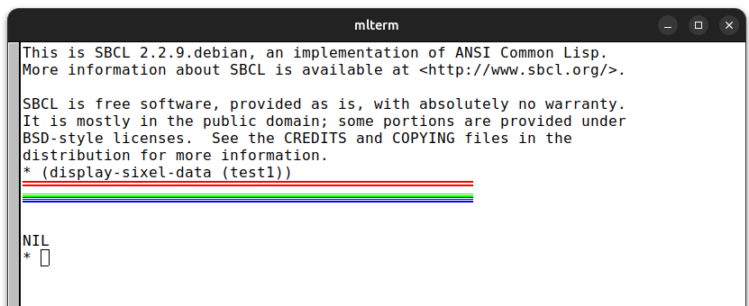
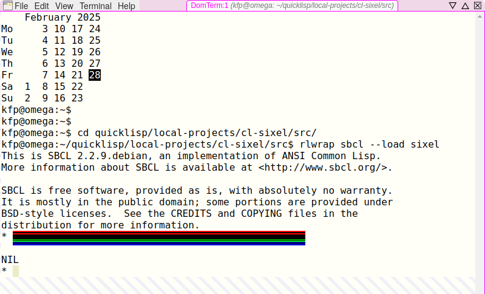

# cl-sixel
Sixel graphics in Common Lisp

:warning: work in progress :construction:

This is a proof of concpet only at the moment. The goal is to have routines
to emit sixel graphics from CL without any externals on the one hand and
to interface CL to Hayaki Saito's awesome `libsixel` (see link below) on the
other. Using FFI seems to be unnecessary for the latter purpose because 
running `img2sixel` with `UIOP` works fine.

## Sixel

* https://en.wikipedia.org/wiki/Sixel
* https://github.com/saitoha
* https://www.vt100.net/docs/vt3xx-gp/chapter14.html

## src/sixel.lisp
The following tests were made with

    (display-sixel-data (test1))
    
in `sixel.lisp`. The format is very simple in principle.

## src/libsixel.lisp

The following is more or less a tranlsation of `latex2sixel` to CL.

## Default parameters

