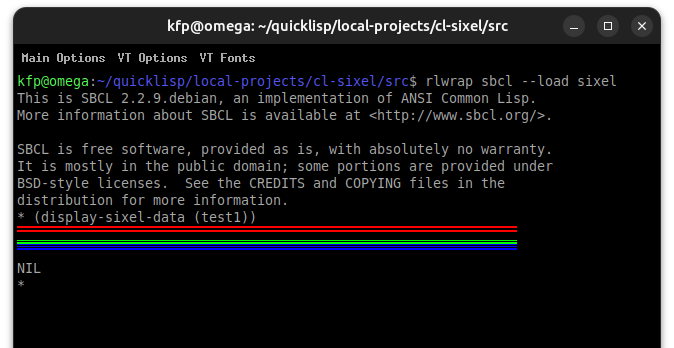

# cl-sixel
Sixel graphics in Common Lisp

:warning: work in progress :construction:

This is a proof of concpet only at the moment. The goal is to have routines
to emit sixel graphics from CL without any externals on the one hand and
to interface CL to Hayaki Saito's awesome `libsixel` (see link below) on the
other. Using FFI seems to be unnecessary for the latter purpose because 
running `img2sixel` with `UIOP` works fine.

The main reason for this is PP in  `cl-weyl`. 


## Sixel

* https://en.wikipedia.org/wiki/Sixel
* https://github.com/saitoha
* https://www.vt100.net/docs/vt3xx-gp/chapter14.html


## Prerequisites

To run `sixel.lisp`:

A sixel capable terminal (xterm, mlterm ...)
  
  https://www.arewesixelyet.com/

  * **xterm** (sixel by default, ReGIS optional)

      https://github.com/xterm-x11/xterm.dev
    
      https://invisible-island.net/xterm/xterm.html
    
  * **mlterm** (sixel by default) excellent when configured!)

    https://github.com/arakiken/mlterm

  * more ==> https://github.com/saitoha/libsixel#terminal-requirements

To run `libsixel.lisp`:

libsixel ==> https://github.com/saitoha/libsixel#install

img2sixel (incldued) ==> https://github.com/saitoha/libsixel#img2sixel)

CLs tested so far: sbcl, npt, ecl, abcl.

[GnuPlot](http://www.gnuplot.info/) supports sixel as well:

```
   gnuplot> set terminal sixel

   Terminal type is now 'sixelgd'
   Options are 'notruecolor nocrop enhanced butt anchor size 640,480 font "arial,12.0" '
   gnuplot>
   gnuplot> test
```
 
If your terminal is lucky then ...


## src/sixel.lisp
The following tests were made with

    (display-sixel-data (test1))
    
in `sixel.lisp`. The format is very simple in principle (also see header there).





## src/libsixel.lisp

The following is more or less a tranlsation of `latex2sixel`[^1] to CL.


## Default parameters


[^1]:https://github.com/nilqed/latex2sixel

:date:

